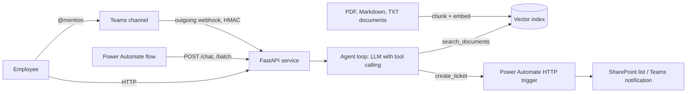

# Agentic GenAI Assistant for Enterprise Documents

An LLM agent that answers employee questions from company documents (RAG) and takes workflow
actions such as opening tickets. It is served as a FastAPI service for **real-time chat** and
**batch inference**, and plugs into **Microsoft Teams** and **Power Automate** low-code workflows
through REST APIs.

**Stack:** Python, LangChain, OpenAI API (tool calling and embeddings), FastAPI, Docker, Microsoft Teams, Power Automate, pytest, GitHub Actions



## How it works

1. **Ingestion** (`assistant/ingest.py`): loads PDF, Markdown and text files, splits them with a
   heading-aware recursive splitter, embeds the chunks and persists the vector index.
2. **Agent** (`assistant/agent.py`): the LLM gets a system prompt and two tools, and loops until it
   can answer, for at most `MAX_AGENT_STEPS` steps:
   - `search_documents`: retrieval over the index (RAG). Answers must be grounded in the retrieved
     text and cite their sources.
   - `create_ticket`: a workflow action. It posts the ticket to a Power Automate HTTP-trigger flow,
     which can create a SharePoint item and notify the right team.
3. **Serving** (`assistant/api.py`):

   | Endpoint | Purpose |
   |---|---|
   | `POST /chat` | Real-time inference, with optional per-session conversation memory |
   | `POST /batch` | Batch inference over up to 500 questions, run in parallel |
   | `POST /ingest` | Rebuild the index after documents change |
   | `POST /integrations/teams` | Microsoft Teams outgoing webhook, verified by HMAC |
   | `GET /health` | Liveness check and index size |

   Callers such as Power Automate authenticate with an optional `X-API-Key` header.
4. **Batch CLI** (`python -m assistant.batch in.jsonl out.jsonl`): offline batch inference over files.
5. **Evaluation** (`eval/`): measures retrieval hit rate and answer accuracy on a labelled question
   set. Use it to tune chunking, prompting and retrieval settings.

### Offline mode

Without `OPENAI_API_KEY`, the service switches to a **deterministic tool-calling model** and
**local hashing embeddings** (`assistant/providers.py`). These follow the same agent protocol
(tool calls, then a grounded answer), so the whole pipeline runs and is tested with no API key
and no cost. With a key set, the same code runs on `ChatOpenAI` and `OpenAIEmbeddings`.

## Quickstart

```bash
python -m venv .venv && source .venv/bin/activate      # Windows: .venv\Scripts\activate
pip install -r requirements-dev.txt
cp .env.example .env                                   # add OPENAI_API_KEY to use a real LLM

python -m assistant.ingest                             # build the index from data/sample_docs
uvicorn assistant.api:app --reload
```

```bash
curl -X POST localhost:8000/chat -H "Content-Type: application/json" \
     -d '{"message": "Within how many hours must a near miss be reported?"}'
# {"answer": "Every incident, injury or near miss must be reported to the site HSE officer within 24 hours. ...",
#  "sources": ["hse_site_safety_policy.md", ...], "actions": [], "steps": 2}

curl -X POST localhost:8000/chat -H "Content-Type: application/json" \
     -d '{"message": "Please open a ticket to request VPN access"}'
# {"answer": "I created ticket TCK-1A2B3C ...", "actions": [{"ticket_id": "TCK-1A2B3C", "category": "IT", ...}], ...}
```

Docker:

```bash
docker compose up --build        # serves on :8000 and mounts ./data/sample_docs as the document folder
```

## Tests and evaluation

```bash
pytest -q                                      # agent, tools, API, Teams HMAC, API key, batch
python -m eval.evaluate --chunk-sizes 300 800 1500
```

Offline-mode results on the bundled question set:

| Chunk size | Retrieval hit@2 | Answer accuracy |
|---|---|---|
| 300 / 800 / 1500 | 100% | 100% (10 questions) |

Accuracy went from 90% to 100% after adding plural stemming to the retrieval features
("passwords" vs "password"). That fix is an example of the evaluate, adjust, re-run loop.

## Integrations

- [Power Automate](integrations/power_automate/README.md): a ticket flow triggered by the agent, and
  any flow calling `/chat` or `/batch` (also usable as a Copilot Studio REST tool)
- [Microsoft Teams](integrations/teams/README.md): an outgoing webhook, or an Azure Bot forwarding to `/chat`

## Project structure

```
assistant/       config, providers (OpenAI / offline), ingest, tools, agent, api, batch
data/sample_docs fictional company policies (HSE, IT, travel and expenses) used as the demo corpus
eval/            labelled questions and evaluation script
integrations/    Power Automate and Teams setup guides
tests/           pytest suite (runs offline)
```

The sample documents describe a **fictional** company and exist only for the demo.
